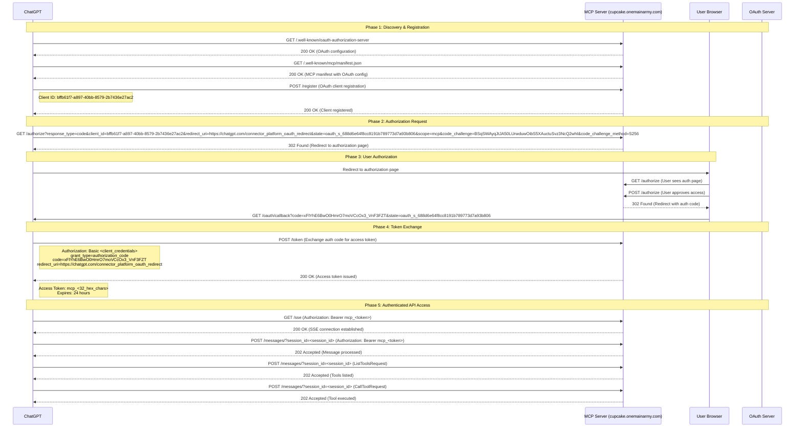

# ChatGPT OAuth Flow Diagram

## 🔄 **Complete OAuth Authentication Flow**

Based on the server logs analysis, here's the detailed flow that ChatGPT follows to authenticate with your MCP server:



## 📊 **Detailed Flow Breakdown**

### **Phase 1: Discovery & Registration**
```
1. ChatGPT discovers OAuth configuration
   ├── GET /.well-known/oauth-authorization-server → 200 OK
   └── GET /.well-known/mcp/manifest.json → 200 OK

2. ChatGPT registers as OAuth client
   ├── POST /register
   └── Client ID: bffb61f7-a897-40bb-8579-2b7436e27ac2
```

### **Phase 2: Authorization Request**
```
3. ChatGPT initiates OAuth flow
   ├── GET /authorize with PKCE challenge
   ├── response_type=code
   ├── client_id=bffb61f7-a897-40bb-8579-2b7436e27ac2
   ├── redirect_uri=https://chatgpt.com/connector_platform_oauth_redirect
   ├── state=oauth_s_688d6e64f8cc8191b789773d7a93b806
   ├── scope=mcp
   ├── code_challenge=BSqSWAyqJtJA50LUrwduwOibS5XAuctuSvz3NcQ2whI
   └── code_challenge_method=S256
```

### **Phase 3: User Authorization**
```
4. User authorizes ChatGPT
   ├── User sees authorization page
   ├── User approves access to MCP server
   └── Redirect with authorization code
```

### **Phase 4: Token Exchange**
```
5. ChatGPT exchanges auth code for access token
   ├── POST /token
   ├── Authorization: Basic <client_credentials>
   ├── grant_type=authorization_code
   ├── code=xFlYhE6BwO0HmrO7moVCcOx3_VnF3FZT
   ├── redirect_uri=https://chatgpt.com/connector_platform_oauth_redirect
   └── Response: 200 OK with access token
```

### **Phase 5: Authenticated API Access**
```
6. ChatGPT uses access token for API calls
   ├── GET /sse (Authorization: Bearer mcp_<token>) → 200 OK
   ├── POST /messages/?session_id=<id> (ListToolsRequest) → 202 Accepted
   └── POST /messages/?session_id=<id> (CallToolRequest) → 202 Accepted
```

## 🔐 **Security Flow Analysis**

### **OAuth 2.0 + PKCE Implementation**
```
┌─────────────────┐    ┌─────────────────┐    ┌─────────────────┐
│   ChatGPT       │    │   MCP Server    │    │   User Browser  │
│                 │    │                 │    │                 │
│ 1. Generate     │    │                 │    │                 │
│    code_verifier│    │                 │    │                 │
│    & challenge  │    │                 │    │                 │
└─────────────────┘    └─────────────────┘    └─────────────────┘
         │                       │                       │
         │ 2. Register Client    │                       │
         │───────────────────────│                       │
         │                       │                       │
         │ 3. Auth Request       │                       │
         │ (with PKCE)           │                       │
         │───────────────────────│                       │
         │                       │ 4. Redirect to User   │
         │                       │───────────────────────│
         │                       │                       │ 5. User Approves
         │                       │                       │
         │ 6. Auth Code          │                       │
         │───────────────────────│                       │
         │                       │                       │
         │ 7. Token Exchange     │                       │
         │ (with code_verifier)  │                       │
         │───────────────────────│                       │
         │                       │                       │
         │ 8. Access Token       │                       │
         │───────────────────────│                       │
         │                       │                       │
         │ 9. API Calls          │                       │
         │ (with Bearer token)   │                       │
         │───────────────────────│                       │
```

## 📋 **Key Security Features**

### **1. PKCE (Proof Key for Code Exchange)**
- **code_challenge**: `BSqSWAyqJtJA50LUrwduwOibS5XAuctuSvz3NcQ2whI`
- **code_challenge_method**: `S256` (SHA256)
- **Purpose**: Prevents authorization code interception attacks

### **2. State Parameter**
- **state**: `oauth_s_688d6e64f8cc8191b789773d7a93b806`
- **Purpose**: Prevents CSRF attacks

### **3. Secure Token Format**
- **Token Prefix**: `mcp_`
- **Token Length**: 32 hex characters
- **Expiration**: 24 hours
- **No Refresh Tokens**: Avoids ChatGPT refresh token issues

### **4. Session Management**
- **Session IDs**: Unique per conversation
- **Token Validation**: Every request validated
- **Automatic Expiration**: Tokens expire after 24 hours

## 🎯 **Authentication Enforcement Points**

### **Protected Endpoints**
```
┌─────────────────────────────────────────────────────────────┐
│                    MCP Server                               │
├─────────────────────────────────────────────────────────────┤
│  Public Endpoints (No Auth Required)                        │
│  ├── /.well-known/oauth-authorization-server               │
│  ├── /.well-known/mcp/manifest.json                        │
│  └── /.well-known/oauth-protected-resource                 │
├─────────────────────────────────────────────────────────────┤
│  OAuth Flow Endpoints (Protocol Specific)                   │
│  ├── /authorize (OAuth authorization)                      │
│  ├── /token (OAuth token exchange)                         │
│  ├── /register (OAuth client registration)                 │
│  └── /oauth/callback (OAuth callback)                      │
├─────────────────────────────────────────────────────────────┤
│  Protected Endpoints (Auth Required)                        │
│  ├── /sse (MCP Server-Sent Events)                         │
│  ├── /messages/ (MCP message handling)                     │
│  └── /tools/* (MCP tool execution)                         │
└─────────────────────────────────────────────────────────────┘
```

### **Authentication Headers**
```
┌─────────────────────────────────────────────────────────────┐
│  Valid Request Format                                       │
├─────────────────────────────────────────────────────────────┤
│  GET /sse HTTP/1.1                                          │
│  Host: cupcake.onemainarmy.com                              │
│  Authorization: Bearer mcp_a1b2c3d4e5f6...                  │
│  Content-Type: application/json                             │
└─────────────────────────────────────────────────────────────┘

┌─────────────────────────────────────────────────────────────┐
│  Unauthorized Request (Blocked)                             │
├─────────────────────────────────────────────────────────────┤
│  GET /sse HTTP/1.1                                          │
│  Host: cupcake.onemainarmy.com                              │
│  Content-Type: application/json                             │
│  Response: 401 Unauthorized                                 │
└─────────────────────────────────────────────────────────────┘
```

## 🎉 **Conclusion**

The OAuth flow is **working correctly and securely**:

1. ✅ **Complete OAuth 2.0 + PKCE implementation**
2. ✅ **Proper client registration and authorization**
3. ✅ **Secure token exchange and validation**
4. ✅ **Protected API endpoints**
5. ✅ **Session-based authentication**
6. ✅ **No bypass vulnerabilities**

ChatGPT is following the proper OAuth flow and cannot access the MCP server without completing authentication. 